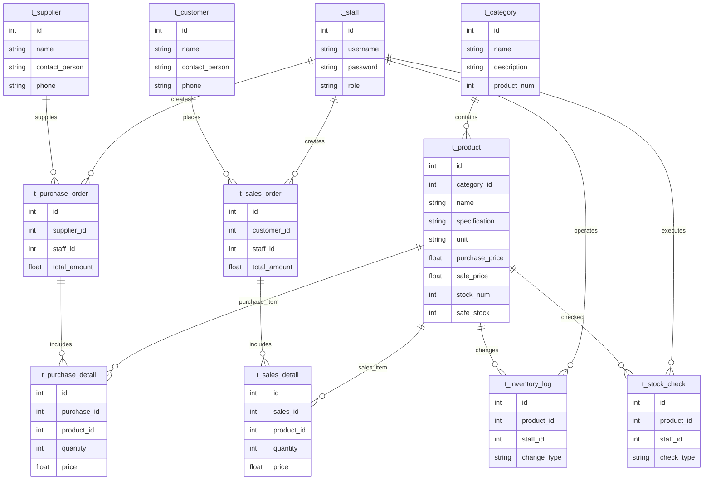

```mermaid
erDiagram

    t_category {
        int id
        string name
        string description
        int product_num
    }

    t_product {
        int id
        int category_id
        string name
        string specification
        string unit
        float purchase_price
        float sale_price
        int stock_num
        int safe_stock
    }

    t_supplier {
        int id
        string name
        string contact_person
        string phone
    }

    t_customer {
        int id
        string name
        string contact_person
        string phone
    }

    t_staff {
        int id
        string username
        string password
        string role
    }

    t_purchase_order {
        int id
        int supplier_id
        int staff_id
        float total_amount
    }

    t_purchase_detail {
        int id
        int purchase_id
        int product_id
        int quantity
        float price
    }

    t_sales_order {
        int id
        int customer_id
        int staff_id
        float total_amount
    }

    t_sales_detail {
        int id
        int sales_id
        int product_id
        int quantity
        float price
    }

    t_inventory_log {
        int id
        int product_id
        int staff_id
        string change_type
    }

    t_stock_check {
        int id
        int product_id
        int staff_id
        string check_type
    }

    t_category ||--o{ t_product : contains

    t_supplier ||--o{ t_purchase_order : supplies

    t_staff ||--o{ t_purchase_order : creates

    t_purchase_order ||--o{ t_purchase_detail : includes

    t_product ||--o{ t_purchase_detail : purchase_item

    t_customer ||--o{ t_sales_order : places

    t_staff ||--o{ t_sales_order : creates

    t_sales_order ||--o{ t_sales_detail : includes

    t_product ||--o{ t_sales_detail : sales_item

    t_product ||--o{ t_inventory_log : changes

    t_staff ||--o{ t_inventory_log : operates

    t_product ||--o{ t_stock_check : checked

    t_staff ||--o{ t_stock_check : executes
```